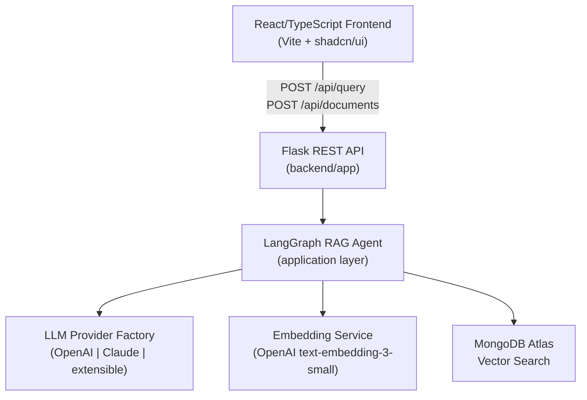

# SmartNotes: RAG System Modernization Plan

## Phase 1: Codebase Audit Findings

### Current Architecture

The entire application lives in a **single Python script** (`Rag_test`) with a Tkinter desktop GUI. There is no web server, no frontend, and no separation of concerns.

| Component | Current State |
|---|---|
| LLM | OpenAI `gpt-3.5-turbo`, hardcoded |
| Embeddings | `OpenAIEmbeddings`, hardcoded |
| Vector Store | MongoDB Atlas Vector Search |
| Retrieval | LangChain LCEL `RunnableParallel` chain |
| UI | Tkinter desktop GUI |
| Config | `key_param.py` (secrets in source file) |
| Chunking | `RecursiveCharacterTextSplitter` (1200/300) |
| Dedup | MD5 hash of raw PDF bytes |

### Strengths
- ✅ Solid MongoDB Atlas vector search foundation
- ✅ Duplicate detection via MD5 file hash
- ✅ Basic LCEL retrieval chain (modern LangChain pattern)
- ✅ Sensible anti-hallucination prompt ("I don't know based on the provided context")

### Weaknesses & Risks
- ❌ **No API server** — entire logic is a desktop GUI script; zero deployability
- ❌ **Secrets in source** — `key_param.py` will leak credentials if pushed to GitHub
- ❌ **Single provider lock-in** — OpenAI is hardcoded at every call site
- ❌ **No error handling** — network errors, API rate limits, and malformed PDFs all crash silently
- ❌ **No context citation** — responses give no indication of which document answered the query (hallucination risk)
- ❌ **No async support** — synchronous calls will block under any real load
- ❌ **Static chunk size** — 1200-token chunks with no adaptive logic; large tables/code blocks will be split mid-content
- ❌ **No type hints** — zero Python type annotations
- ❌ **`gpt-3.5-turbo`** — outdated; modern deployments use `gpt-4o-mini` or better
- ❌ **Retrieves 5 docs flat** — no re-ranking, no MMR (Maximum Marginal Relevance) for diversity
- ❌ **No observability** — no logging, no tracing, no metrics
- ❌ **`requirements.txt` unpinned** — will break on any major library update

---

## User Review Required

> [!IMPORTANT]
> **Provider Selection**: The plan adds **Anthropic Claude 3.5 Sonnet** as the second LLM provider. A `CLAUDE_API_KEY` environment variable will be required. If you want a different second provider (e.g., Google Gemini, Mistral), let me know before I proceed.

> [!WARNING]
> **MongoDB Atlas**: The modernized system still requires a MongoDB Atlas cluster with a configured **Vector Search index** named `vector_index`. The existing data in your cluster is fully compatible — no migration needed.

> [!IMPORTANT]
> **New Project Structure**: The single `Rag_test` file will be replaced with a proper `backend/` + `frontend/` directory layout. The old file will be preserved in git history but removed from the working tree.

---

## Phase 2: Proposed Architecture



---

## Phase 3: Proposed Changes

### Project Structure

```
SMARTNOTES/
├── backend/
│   ├── app/
│   │   ├── domain/              # Pure business logic, no I/O
│   │   │   └── models.py        # Pydantic models (QueryRequest, QueryResponse, Document)
│   │   ├── application/         # Use-cases / orchestration
│   │   │   ├── rag_graph.py     # LangGraph stateful RAG agent
│   │   │   └── document_service.py  # Ingest orchestration
│   │   ├── infrastructure/      # I/O adapters
│   │   │   ├── llm_factory.py   # Multi-provider LLM abstraction
│   │   │   ├── embedding.py     # Embedding provider
│   │   │   ├── vector_store.py  # MongoDB Atlas wrapper
│   │   │   └── pdf_parser.py    # PDF loading & chunking
│   │   └── api/
│   │       ├── routes.py        # Flask blueprints
│   │       └── errors.py        # Global error handler
│   ├── config.py                # Pydantic-settings, loads .env
│   ├── main.py                  # Flask app factory
│   ├── requirements.txt
│   └── Dockerfile
├── frontend/
│   ├── src/
│   │   ├── components/          # Chat, Upload, ProviderSelector
│   │   ├── hooks/               # useQuery, useUpload custom hooks
│   │   ├── types/               # TypeScript interfaces
│   │   └── App.tsx
│   ├── package.json
│   └── Dockerfile
├── .github/
│   └── workflows/
│       └── deploy.yml
├── docker-compose.yml
├── .env.example
└── README.md
```

---

### Backend (`backend/`)

#### [NEW] `backend/app/infrastructure/llm_factory.py`

The centerpiece of the multi-provider abstraction. Returns a `BaseChatModel` compatible with LangChain/LangGraph regardless of the underlying provider.

```python
def get_llm(provider: Literal["openai", "anthropic"], **kwargs) -> BaseChatModel:
    if provider == "openai":
        return ChatOpenAI(model="gpt-4o-mini", ...)
    elif provider == "anthropic":
        return ChatAnthropic(model="claude-3-5-sonnet-20241022", ...)
    raise ValueError(f"Unknown provider: {provider}")
```

The `provider` is passed in via the API request body, defaulting to `"openai"` — so the frontend can expose a **provider selector dropdown** to show off the multi-LLM capability.

#### [NEW] `backend/app/application/rag_graph.py`

Migrates the flat LCEL chain to a **LangGraph `StateGraph`** with named nodes and explicit state transitions. This enables:
- Conditional routing (e.g., "if retrieved docs are empty, return canned response instead of hallucinating")
- Future extension: self-corrective RAG, multi-hop reasoning, tool use
- Clear observability of each step

```
                   ┌─────────────────┐
                   │   START         │
                   └────────┬────────┘
                            ▼
                   ┌─────────────────┐
                   │   retrieve      │  ← Vector search
                   └────────┬────────┘
                            ▼
                   ┌─────────────────┐
              ┌─── │  grade_docs     │  ← Are any docs relevant?
              │    └────────┬────────┘
              │             ▼ (yes)
              │    ┌─────────────────┐
              │    │   generate      │  ← LLM call with context
              │    └────────┬────────┘
              │             ▼
              │    ┌─────────────────┐
              │    │   END           │
              │    └─────────────────┘
              │ (no docs)
              └──► ┌─────────────────┐
                   │  no_context     │  ← Return "no context" msg
                   └─────────────────┘
```

#### [MODIFY] Retrieval Strategy
- Switch to **MMR** (`search_type="mmr"`) for diverse, non-redundant context
- Increase `k` to 8 (fetch 8, MMR selects best 5)
- **Source citation**: each `QueryResponse` includes `sources` (list of filenames/page numbers)

#### [NEW] `backend/config.py`

All secrets loaded from `.env` via `pydantic-settings`. No secrets ever in Python source:
```
OPENAI_API_KEY=
ANTHROPIC_API_KEY=
MONGO_URI=
DEFAULT_LLM_PROVIDER=openai
```

---

### Frontend (`frontend/`)

React 18 + TypeScript + Vite + Tailwind CSS (since this is a portfolio piece, Tailwind is acceptable here for rapid UI quality). Key screens:

1. **Chat view** — conversation history, streaming responses, source citations shown below each answer
2. **Upload panel** — drag-and-drop PDF upload, progress indicator
3. **Provider selector** — dropdown to switch between OpenAI and Claude in real-time

---

### Infrastructure (`Phase 4`)

#### Deployment Strategy
| Service | Platform | Details |
|---|---|---|
| **Frontend** | **Vercel** | Auto-deploys from `frontend/` on push to `main` |
| **Backend** | **Railway** | Auto-deploys from `backend/` on push to `main` |
| **Database** | **MongoDB Atlas** | Cloud-hosted (existing cluster, no changes) |

#### [NEW] `backend/Procfile` + `backend/railway.json`
Railway config: start command, health check, env var references.

#### [NEW] `frontend/vercel.json`
Vercel config: SPA rewrites, environment variable references for `VITE_API_URL`.

#### [NEW] `.github/workflows/deploy.yml`

Pipeline stages:
1. **lint** — `ruff` (Python), `eslint` (TypeScript)
2. **test** — `pytest` backend unit tests
3. **deploy-backend** — Trigger Railway deployment on `main` push
4. **deploy-frontend** — Trigger Vercel deployment on `main` push

---

## Verification Plan

### Automated Tests
After Phase 3 is complete, I will write and run:

```bash
# Backend unit tests (pytest)
cd backend && pytest tests/ -v

# TypeScript type checking
cd frontend && npx tsc --noEmit

# Lint backend
cd backend && ruff check app/
```

### Manual Verification (Browser)
1. Run `docker-compose up` from project root
2. Navigate to `http://localhost:3000`
3. Upload a PDF → verify success toast appears
4. Ask a question about the PDF → verify answer + source citations appear
5. Switch provider dropdown to Claude → ask same question → verify Claude response appears
6. Ask an off-topic question → verify "I don't know" response (hallucination guard check)
